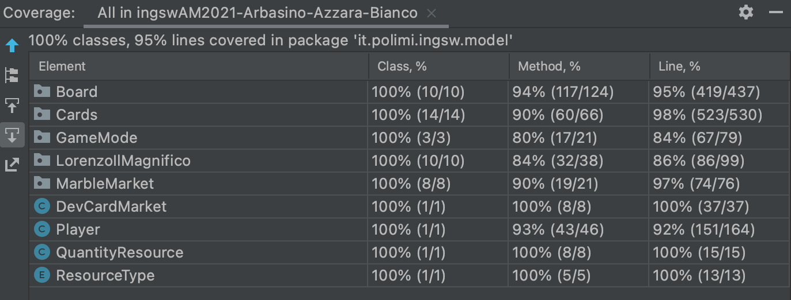

# **Software Engineering 1 : final project - AY 2020-2021**


The purpose of the project is to implement the board game **[Masters Of Renaissance](http://www.craniocreations.it/prodotto/masters-of-renaissance/)** following the architectural pattern Model-View-Controller (MVC) for the realization of the model according to the object-oriented programming paradigm. The final result completely covers the rules defined by the game and allows you to interact with both a command line interface (CLI) and a graphical interface (GUI). The network has been managed with the traditional socket approach.

**Teacher** Alessandro Margara

## **Documentation**
The following documentation includes the documents created for the design of the game, the class diagrams in UML will be listed first then the code documentation (JavaDoc).

### UML
The following class diagrams represent the model according to which the game should have been implemented and the diagrams of the final product.
- [UML Initial](https://github.com/cicabuca/ingswAM2021-Arbasino-Azzara-Bianco/blob/main/deliverables/UML/initialUML.png)
- [UML Final](https://github.com/cicabuca/ingswAM2021-Arbasino-Azzara-Bianco/blob/main/deliverables/UML/finalUML.png)

### JavaDoc
The following documentation includes a description for most of the classes and methods used, follows the Java documentation techniques and can be consulted at the following address: [JavaDoc](https://github.com/cicabuca/ingswAM2021-Arbasino-Azzara-Bianco/tree/main/deliverables/javaDocs)

### Test Coverage
All model methods have been tested (except the getters)



### Libraries and Plugins
|Library/Plugin|Description|
|---------------|-----------|
|__maven__|management tool for software based on Java and build automation|
|__junit__|Java framework for unit testing|
|__JavaFX__|Java graphics library|
|__maven-assembly__|Maven plugin used to create executable jar|

### Jar
The following jar allows to launch the game as described in the following sections.
The features built according to the design specification are listed in the next section while the details about how to launch the system will be defined in the section called __Execution of jar__. 

## **Implemented Functionalities**
| Functionality | Status |
|:-----------------------|:------------------------------------:|
| Basic rules |  |
| Complete rules |  |
| Sockets | |
| GUI |  |
| CLI |  |
| Multiple games |  |
| Disconnection Resilience |  |
| Local Game |  |
| Persistence |  |
| Parameter editor |  |

###### Legend
[]() Not Implemented &nbsp;&nbsp;&nbsp;&nbsp;[]() Implementing&nbsp;&nbsp;&nbsp;&nbsp;[]() Implemented

#### Advanced Functionalities
- `Multiple Games` : server handles multiple instances of game, all players must have different nicknames.
- `Disconnection Resilience` : during a game, if a player disconnects, the game will go on without the disconnected player. Eventually they can re-join the match using the same nickname (if the game is still on). If a player disconnects during the setting-up phase (choosing of leader cards and initial resources), the game is taken down and the players are invited to reconnect in another match. After a player disconnection during the game, if there is only one active player left, the game is taken down and the active player wins the game. 
- `Local Game` : if you want, you can play a single-player game locally (without using socket-connection).

#### Extra Functionalities
- `Cheat` : in order to show in a shorter amount of time the evolution of the game, we implemented a cheat that allows the user to increase the number of each type of resource in the strongbox by ten at a time. <br> In CLI the command is `$$`, in GUI there's a golden coin button that activates it.

## **Minimum requirements**
- Screen Resolution : 1200 x 720 pixels.
- Terminal : - on Unix-based systems "Terminal";<br>&nbsp;&nbsp;&nbsp;&nbsp;&nbsp;&nbsp;&nbsp;&nbsp;&nbsp;&nbsp;&nbsp;&nbsp;&nbsp;&nbsp;&nbsp;&nbsp;&nbsp;- on Windows systems "WLS" or "Windows Terminal Preview".

## **Execution of JAR**
### Application choice
The JAR is unique for server/client side.
The server is run by optionally choosing the number of port.
The client is run by choosing the interface to play with: the possible choices are command line (CLI) or graphical interface (GUI).
The following sections describe how to run the client (in one way or another) or the server.

##### CLI
To launch the client in CLI mode, type the following command:
```
java -jar MastersOfRenaissance.jar -cli
```

##### GUI
To launch the client in GUI mode, type the following command:
```
java -jar MastersOfRenaissance.jar
```

#### Server
To launch the server, type the following command:
```
java -jar MastersOfRenaissance.jar -server -port [port_number]
```
##### Parameters
- `-cli/-server`: allows you to choose which application you want to launch. If not specified the __gui__ will be launched.
- `-port 12345`: allows you to enter the number of server port (only for server launching). If not specified the default value is __12345__;

## **The Team [*JavaComeLava*]**
- [__Arbasino Andrea Paolo__](https://github.com/AndreaArbasino)
- [__Azzarà Daniele__](https://github.com/cicabuca)
- [__Bianco Alessandro__](https://github.com/AlessandroBianco-cpu)

### Copyright and license
Masters Of Renaissance is copyrighted by [Cranio Creations](http://www.craniocreations.it) in 2020.
Licensed under the **[MIT License](https://github.com/cicabuca/ingswAM2021-Arbasino-Azzara-Bianco/blob/main/LICENSE)** : you may not use this software except in compliance with the License.


